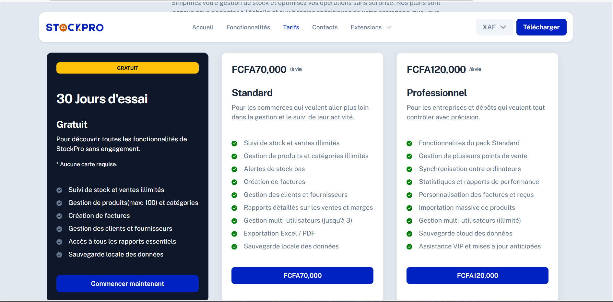
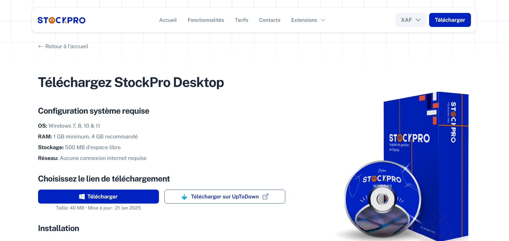
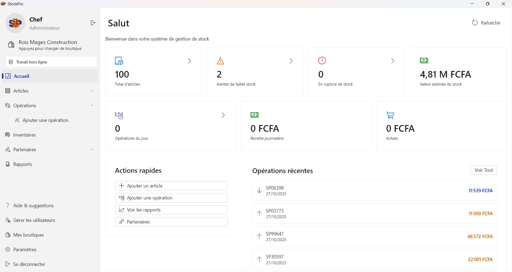

# StockPro Desktop Web

Official website for StockPro Desktop - A comprehensive inventory management software for businesses.

## About

This Angular website serves as the marketing and distribution platform for StockPro Desktop, featuring:

- Product information and features showcase
- Pricing plans and license purchasing
- Software downloads and installation guides
- Customer testimonials and support resources
- Payment integration with NotchPay for license sales

## Screenshots

### Website


*Homepage showcasing StockPro Desktop features*


*Flexible pricing plans for different business needs*


*Secure download and license purchase flow*

### StockPro Desktop Software


*Main dashboard with inventory overview*


*Bulk items add feature*

## Issues & Support

For StockPro Desktop software issues, bug reports, or feature requests, please use the [Issues](../../issues) section of this repository.

## Tech Stack

- Angular 20.3.9
- Bootstrap 5
- Supabase (Database)
- NotchPay (Payment Gateway)

This project was generated using [Angular CLI](https://github.com/angular/angular-cli) version 20.3.9.

## Development server

To start a local development server, run:

```bash
ng serve
```

Once the server is running, open your browser and navigate to `http://localhost:4200/`. The application will automatically reload whenever you modify any of the source files.

## Code scaffolding

Angular CLI includes powerful code scaffolding tools. To generate a new component, run:

```bash
ng generate component component-name
```

For a complete list of available schematics (such as `components`, `directives`, or `pipes`), run:

```bash
ng generate --help
```

## Building

To build the project run:

```bash
ng build
```

This will compile your project and store the build artifacts in the `dist/` directory. By default, the production build optimizes your application for performance and speed.
